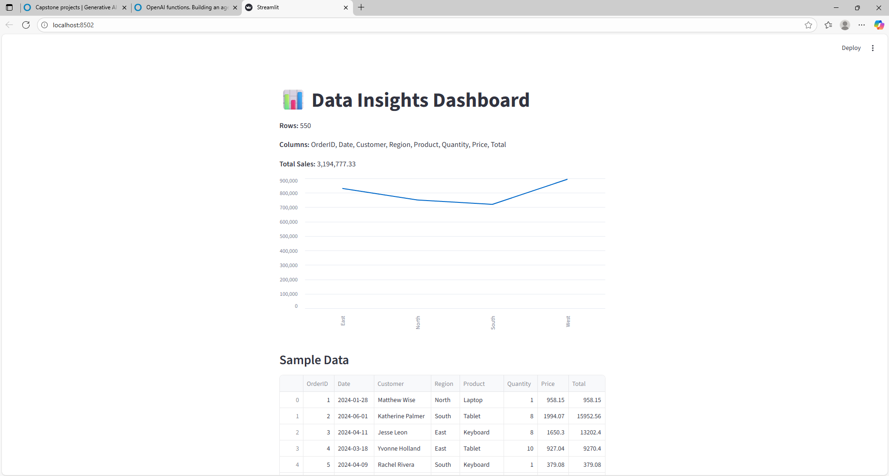
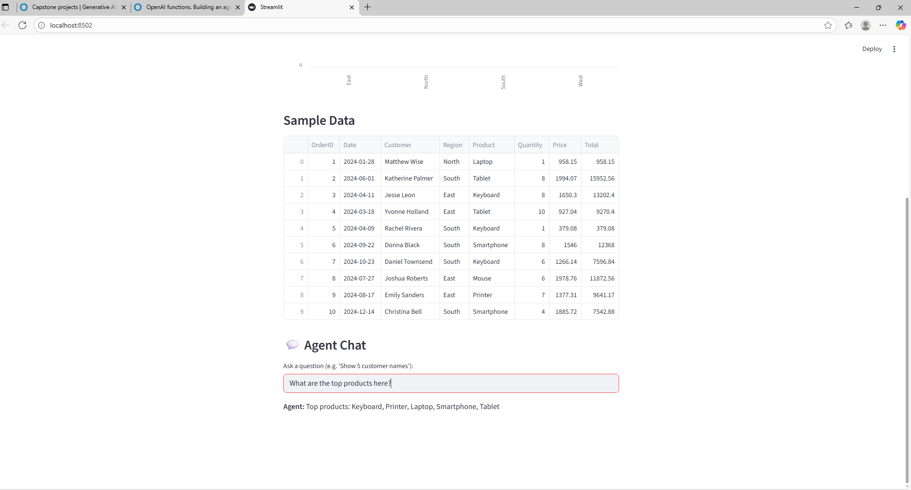

# Data Insights App

A Streamlit-based business data dashboard and intelligent agent for exploring and understanding your sales database with natural queries, function calling, and safety controls.

HugginFace link : https://huggingface.co/spaces/Abdurahmon2603/Capstone1
---

## Features

- **Live Dashboard**: Key business metrics (total rows/columns, total sales), sales by region chart, sample data table.
- **Smart Chat Agent**: Ask plain-language questions about your data. Supports both function-based answers (names/products/sales/averages/tickets) and general free-form chat.
- **OpenAI Function Calling**: Industry-standard agent tools for precise, auditable data access.
- **Secure**: Blocks dangerous operations like delete/update/drop automatically.
- **Support Ticketing**: Users can trigger/ask for a support ticket (simulated, logged to console).
- **Logging**: All agent actions, tool calls, and safety warnings are printed to the console (terminal), for auditing and debugging.
- **Python + Streamlit UI**: Web-accessible interface, no client installation required.
- **Backend**: All business data is loaded from a SQLite database (`data/sales_data.db`).
- **Ready for Extensions**: Add more SQL tools/options with one function.

---

## Screenshots

---

## Prerequisites & Setup

- Python 3.9 or higher recommended
- (If missing) [Install pip](https://pip.pypa.io/en/stable/installation/)

### 1. Install Dependencies

Save this content as your `dependencies.txt`:
streamlit
pandas
openai

text
Then, run:
pip install -r dependencies.txt

text

### 2. Setting Up Your OpenAI API Key

**IMPORTANT:**  

#### Using Streamlit Secrets

1. Create a file called `.streamlit/secrets.toml` in your project root or in a `.streamlit` folder.
2. Add your API key like this:

OPENAI_API_KEY = "sk-XXXXXXXXXXXXXXXXXXXXXXXXXXXXXXXXXXXXXX"

text

3. Your code will automatically read the key using:
import streamlit as st
OPENAI_API_KEY = st.secrets["OPENAI_API_KEY"]

text

---

## Running the App

Start the Streamlit server:
streamlit run app.py

text
The app will open in your default browser.

---

## Usage Guide

1. **Explore Dashboard:**  
   See live data, total sales by region (chart), and a table sample.

2. **Ask Questions in Chat:**  
   * Example tool queries:  
     - “Show me 5 customer names”  
     - “What are the top products?”  
     - “What is the average price?”  
     - “List total sales for West region”  
   * Example general queries:  
     - “Describe the table structure”  
     - “How many columns are there?”  
     - “Can you help me find issues in this data?”

3. **Dangerous Queries (Blocked):**  
   - E.g. “delete table”, “drop everything”  
     - The agent blocks these for your safety and notifies you.

4. **Support Ticket:**  
   - Ask for support or raise an issue (“I need help”, “create ticket for billing problem”). The agent logs the request.

5. **Console Logging:**  
   - All tool calls and warnings show up in your terminal or command prompt for grading/audit.

---

## Security & Safety

- All write/dangerous commands are blocked to prevent unwanted data changes
- The OpenAI API key is secured in `secrets.toml`

---

## Troubleshooting

- **App doesn't detect your API key**: Make sure `.streamlit/secrets.toml` exists with the key line as above.  
- **No 'sales_data' table error**: Check that your `sales_data.db` includes the correct table (see creation script in the assignment).

---
